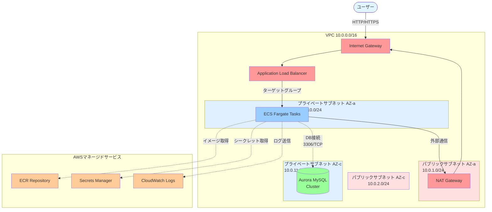

# AWS デプロイメントガイド

このガイドでは、Rails 7.2アプリケーションをAWS上にTerraformを使ってデプロイする手順を説明します。

## アーキテクチャ概要

このTerraform構成は以下のAWSリソースを作成します：

- **VPC**: プライベートネットワーク環境
  - パブリックサブネット x2（ALB用）
  - プライベートサブネット x2（ECS, RDS用）
  - NAT Gateway（プライベートサブネットからのインターネットアクセス用）
- **ECS Fargate**: コンテナ化されたRailsアプリケーション
- **RDS MySQL 8.0**: マネージドデータベース
- **ALB**: アプリケーションロードバランサー
- **ECR**: Dockerイメージレジストリ
- **Secrets Manager**: 機密情報の管理
- **CloudWatch**: ログとモニタリング

### アーキテクチャ図



**ネットワークフロー:**
1. ユーザーリクエストがInternet Gateway経由でALBに到達
2. ALBがプライベートサブネット内のECS Fargateタスクにルーティング
3. ECSタスクがNAT Gateway経由で外部リソース（パッケージ更新等）にアクセス
4. ECSタスクがプライベートサブネット内のAurora MySQLに接続
5. ECSタスクがECR、Secrets Manager、CloudWatch LogsなどのAWSサービスを利用

**マルチAZ構成:**
- パブリックサブネット: AZ-aとAZ-c（ALBとNAT Gatewayを配置）
- プライベートサブネット: AZ-aとAZ-c（ECS TasksとAuroraを配置）
- 冗長性と高可用性を確保

**セキュリティ層:**
- パブリックサブネット: インターネットからアクセス可能（ALB、NAT Gateway）
- プライベートサブネット: 内部のみアクセス可能（ECS、RDS）
- セキュリティグループでトラフィックを厳密に制御

## 前提条件

1. AWSアカウント
2. AWS CLI（設定済み）
3. Terraform >= 1.0
4. Docker
5. config/master.keyファイル（Rails credentials用）

## デプロイ手順

### 1. AWS認証情報の設定

```bash
# AWS CLIで認証情報を設定
aws configure
```

認証情報が正しく設定されているか確認：

```bash
# AWS認証情報の確認
aws sts get-caller-identity
```

**このコマンドについて:**

- **`sts`**: Security Token Service（セキュリティトークンサービス）の略
  - AWS IAM (Identity and Access Management) の一部で、一時的な認証情報を管理するサービス
  - APIキーの検証、ロールの引き受け、フェデレーションなどの認証関連機能を提供

- **`get-caller-identity`**: 現在のAPI呼び出し元の身元情報を取得するコマンド
  - AWS CLIを実行しているユーザーまたはロールの情報を表示
  - 読み取り専用コマンドのため、何も変更せず料金も発生しません
  - 認証設定が正しいかを確認する最も簡単な方法

- **表示される情報:**
  - `UserId`: IAMユーザーまたはロールの一意識別子（例: AIDAI1234567890ABCDE）
  - `Account`: AWSアカウントID（12桁の数字、例: 123456789012）
  - `Arn`: 認証情報の完全なARN（Amazon Resource Name、例: arn:aws:iam::123456789012:user/myname）

**実行例:**
```json
{
    "UserId": "AIDAI1234567890ABCDE",
    "Account": "123456789012",
    "Arn": "arn:aws:iam::123456789012:user/myname"
}
```

正常に上記のような情報が表示されれば、AWS CLIの設定は完了です。

### 2. RAILS_MASTER_KEYの確認

```bash
# config/master.keyの内容を確認
cat config/master.key
```

このキーは後で使用します。

### 3. Terraform変数の設定

`terraform.tfvars`ファイルを作成します：

```bash
cd terraform
cat > terraform.tfvars <<EOF
aws_region        = "ap-northeast-1"
app_name          = "rails-app"
environment       = "production"
container_cpu     = 256
container_memory  = 512
rails_master_key  = "YOUR_RAILS_MASTER_KEY_HERE"
EOF
```

**注意**: `YOUR_RAILS_MASTER_KEY_HERE`を実際の`config/master.key`の内容に置き換えてください。

### 4. Terraformの初期化

```bash
terraform init
```

### 5. 実行プランの確認

```bash
# 実行プランを作成してファイルに保存（推奨）
terraform plan -out=tfplan
```

作成されるリソースを確認します（31個のリソースが作成されます）。

**tfplanファイルとは:**
- `terraform plan -out=tfplan`で作成される実行プランのバイナリファイル
- planで確認した内容を確実に実行できる
- 計画時と実行時の間に設定が変更されても、保存された計画が優先される

### 6. インフラストラクチャのデプロイ

**方法1: planファイルを使う（推奨）**

```bash
terraform apply tfplan
```

保存されたプランをそのまま実行します（確認プロンプトなし）。

**方法2: 直接apply**

```bash
terraform apply
```

確認プロンプトで`yes`と入力します。

このステップでは以下が作成されます：
- VPC、サブネット、NAT Gateway
- RDS MySQLインスタンス（10-15分かかります）
- ECS Cluster
- ALB
- ECR Repository
- Secrets Manager

### 7. Dockerイメージのビルドとプッシュ

Terraformの出力からECRリポジトリURLとログインコマンドを取得します：

```bash
# ECRリポジトリURLを取得
export ECR_REPO=$(terraform output -raw ecr_repository_url)

# ECRにログイン
aws ecr get-login-password --region ap-northeast-1 | docker login --username AWS --password-stdin $ECR_REPO

# プロジェクトルートディレクトリに戻る
cd ..

# Dockerイメージをビルド
docker build --platform linux/amd64 -t $ECR_REPO:latest .

# イメージをECRにプッシュ
docker push $ECR_REPO:latest
```

### 8. ECSサービスの起動

イメージをプッシュしたら、ECSサービスを更新してタスクを起動します：

```bash
# terraformディレクトリに移動
cd terraform

# ECSサービスを更新（新しいイメージでタスクを起動）
aws ecs update-service \
  --cluster rails-app-cluster \
  --service rails-app-service \
  --force-new-deployment \
  --region ap-northeast-1
```

タスクの起動を待ちます（2-3分）：

```bash
# 実行中のタスク数を確認
aws ecs describe-services \
  --cluster rails-app-cluster \
  --services rails-app-service \
  --query 'services[0].runningCount' \
  --region ap-northeast-1
```

`1` と表示されたら次のステップに進みます。

### 9. データベースのマイグレーション

ECSタスクが起動したら、ECS Execを使ってデータベースマイグレーションを実行します：

```bash
# 実行中のタスクIDを取得
TASK_ID=$(aws ecs list-tasks \
  --cluster rails-app-cluster \
  --service-name rails-app-service \
  --region ap-northeast-1 \
  --query 'taskArns[0]' \
  --output text | cut -d'/' -f3)

# マイグレーションを実行
aws ecs execute-command \
  --cluster rails-app-cluster \
  --task $TASK_ID \
  --container rails-app \
  --interactive \
  --command "rails db:migrate" \
  --region ap-northeast-1
```

**注意:** ECS Execを使用するには、AWS Session Managerプラグインのインストールが必要です（詳細は「ECS Execでコンテナに接続」セクション参照）。

### 10. アプリケーションへのアクセス

```bash
# ALBのDNS名を取得
terraform output load_balancer_dns
```

ブラウザで表示されたURLにアクセスします：
```
http://your-alb-dns-name.ap-northeast-1.elb.amazonaws.com
```

## 重要な出力値

デプロイ後、以下の情報を確認できます：

```bash
# ロードバランサーのURL
terraform output load_balancer_dns

# データベースホスト
terraform output database_host

# ECRログインコマンド
terraform output ecr_login_command
```

## コスト概算（最安構成）

このインフラストラクチャの月額コスト概算（東京リージョン）：

| リソース | スペック | 月額コスト |
|---------|---------|-----------|
| ECS Fargate | 1タスク, 0.25vCPU, 0.5GB | ~$10 |
| RDS MySQL | db.t3.micro, 20GB | ~$25 |
| ALB | 基本料金 | ~$25 |
| NAT Gateway | 基本料金 + データ転送 | ~$35 |
| データ転送 | 変動 | ~$5 |

**合計**: **約$100/月**

### さらにコストを削減する方法

詳細は [cost-optimization.md](cost-optimization.md) を参照してください。

**主なオプション:**
- NAT Gatewayを削除してECSをパブリックサブネットで実行: **-$35/月**
- 使わない時はリソースを停止: **-$70〜90/月**
- Fargate Spotを使用: **-70%割引**

## メンテナンス

### モニタリングとデバッグコマンド

#### 1. ECSサービスの状態確認

```bash
# ECSサービスの基本情報を確認
aws ecs describe-services \
  --cluster rails-app-cluster \
  --services rails-app-service \
  --query 'services[0].{running:runningCount,pending:pendingCount,desired:desiredCount,status:status}'
```

**オプションの意味:**
- `--cluster`: ECSクラスター名を指定
- `--services`: 確認したいサービス名を指定
- `--query`: JMESPath形式でJSON出力をフィルタリング
  - `runningCount`: 実行中のタスク数
  - `pendingCount`: 起動中のタスク数
  - `desiredCount`: 目標タスク数
  - `status`: サービスの状態（ACTIVE/DRAINING/INACTIVE）

#### 2. デプロイ状態の詳細確認

```bash
# デプロイの詳細状態を確認
aws ecs describe-services \
  --cluster rails-app-cluster \
  --services rails-app-service \
  --query 'services[0].deployments[].{status:status,running:runningCount,pending:pendingCount,taskDef:taskDefinition}'
```

**オプションの意味:**
- `deployments[]`: 現在のデプロイ一覧（通常は1-2個）
  - `status`: PRIMARY（現在稼働中）またはACTIVE（更新中）
  - `taskDefinition`: 使用しているタスク定義のバージョン

#### 3. ALBターゲットヘルスの確認

```bash
# ターゲットグループARNを取得
TARGET_GROUP_ARN=$(aws elbv2 describe-target-groups \
  --region ap-northeast-1 \
  --query 'TargetGroups[?TargetGroupName==`rails-app-tg`].TargetGroupArn' \
  --output text)

# ターゲットの健全性を確認（簡易版）
aws elbv2 describe-target-health \
  --target-group-arn $TARGET_GROUP_ARN \
  --region ap-northeast-1 \
  --query 'TargetHealthDescriptions[].TargetHealth.{State:State,Reason:Reason}'

# ターゲットの詳細情報を確認（完全版）
aws elbv2 describe-target-health \
  --target-group-arn $TARGET_GROUP_ARN \
  --region ap-northeast-1
```

**オプションの意味:**
- `--target-group-arn`: ターゲットグループのARN（terraform outputから取得可能）
- 返される状態:
  - `healthy`: ヘルスチェック成功、トラフィック受信中
  - `unhealthy`: ヘルスチェック失敗
  - `initial`: 初期ヘルスチェック中
  - `draining`: 削除中（接続切断待ち）
  - `unused`: 未使用

**よくある理由（Reason）:**
- `Target.ResponseCodeMismatch`: HTTPステータスコードが期待と異なる（例: 301, 500）
- `Target.Timeout`: タイムアウト
- `Target.FailedHealthChecks`: ヘルスチェック失敗
- `Target.DeregistrationInProgress`: ターゲット削除中

#### 4. CloudWatch Logsの確認

```bash
# 最新のログをリアルタイム表示
aws logs tail /ecs/rails-app --follow

# 過去5分間のログを表示
aws logs tail /ecs/rails-app --since 5m

# 過去30分間のログを表示
aws logs tail /ecs/rails-app --since 30m

# エラーのみをフィルタ
aws logs tail /ecs/rails-app --follow --filter-pattern "ERROR"
```

**オプションの意味:**
- `/ecs/rails-app`: ロググループ名
- `--follow`: 新しいログをリアルタイムで表示（Ctrl+Cで停止）
- `--since <時間>`: 指定した時間以降のログを表示
  - 例: `5m`（5分）、`1h`（1時間）、`2d`（2日）
- `--filter-pattern`: ログをフィルタリング

#### 5. ECSタスクの詳細確認

```bash
# 実行中のタスクIDを取得
TASK_ID=$(aws ecs list-tasks \
  --cluster rails-app-cluster \
  --service-name rails-app-service \
  --desired-status RUNNING \
  --query 'taskArns[0]' \
  --output text)

# タスクの詳細情報を確認
aws ecs describe-tasks \
  --cluster rails-app-cluster \
  --tasks $TASK_ID
```

**オプションの意味:**
- `--desired-status RUNNING`: 実行中のタスクのみ取得
- `--output text`: テキスト形式で出力（変数に代入しやすい）

#### 6. Dockerイメージの再ビルドとデプロイ

```bash
# 0. ECRリポジトリURLを取得（terraformディレクトリから）
cd terraform
export ECR_REPO=$(terraform output -raw ecr_repository_url)
cd ..

# 1. コードを修正後、Dockerイメージを再ビルド
docker build --platform linux/amd64 -t $ECR_REPO:latest .

# 2. ECRにプッシュ
docker push $ECR_REPO:latest

# 3. ECSサービスを更新（新しいイメージでタスクを起動）
aws ecs update-service \
  --cluster rails-app-cluster \
  --service rails-app-service \
  --force-new-deployment \
  --region ap-northeast-1
```

**オプションの意味:**
- `--platform linux/amd64`: ARM64 Mac用（x86_64アーキテクチャでビルド）
- `-t <イメージ名>`: タグ名を指定
- `--force-new-deployment`: タスク定義が同じでも強制的に新しいタスクを起動

#### 7. ECRイメージの確認

```bash
# ECRにあるイメージ一覧を表示
aws ecr describe-images \
  --repository-name rails-app \
  --query 'sort_by(imageDetails,& imagePushedAt)[-5:]' \
  --output table
```

**オプションの意味:**
- `--repository-name`: ECRリポジトリ名
- `sort_by(imageDetails,& imagePushedAt)[-5:]`: プッシュ日時でソートして最新5件を表示

### ログの確認

```bash
# CloudWatch Logsでログを確認
aws logs tail /ecs/rails-app --follow
```

### ECS Execでコンテナに接続

ECS Execを使用してコンテナ内でコマンドを実行できます（SSH不要）。

#### 前提条件

初回のみ、AWS Session Managerプラグインのインストールが必要です：

**macOS:**
```bash
brew install --cask session-manager-plugin
```

**または手動インストール（macOS ARM64）:**
```bash
curl "https://s3.amazonaws.com/session-manager-downloads/plugin/latest/mac_arm64/session-manager-plugin.pkg" -o "session-manager-plugin.pkg"
sudo installer -pkg session-manager-plugin.pkg -target /
```

**Linux:**
```bash
curl "https://s3.amazonaws.com/session-manager-downloads/plugin/latest/ubuntu_64bit/session-manager-plugin.deb" -o "session-manager-plugin.deb"
sudo dpkg -i session-manager-plugin.deb
```

インストール確認：
```bash
session-manager-plugin --version
```

#### コンテナへの接続

```bash
# タスクIDを取得
TASK_ID=$(aws ecs list-tasks \
  --cluster rails-app-cluster \
  --service-name rails-app-service \
  --region ap-northeast-1 \
  --query 'taskArns[0]' \
  --output text | cut -d'/' -f3)

# bashで対話的に接続
aws ecs execute-command \
  --cluster rails-app-cluster \
  --task $TASK_ID \
  --container rails-app \
  --interactive \
  --command "/bin/bash" \
  --region ap-northeast-1
```

接続後、コンテナ内で以下のような操作ができます：

```bash
pwd                           # /rails
ls -la                        # ファイル一覧
rails console                 # Railsコンソール
rails db:migrate              # マイグレーション実行
rails db:migrate:status       # マイグレーション状態確認
cat log/production.log        # ログ確認
tail -f log/production.log    # ログをリアルタイム表示
env                           # 環境変数確認
```

#### 単発コマンドの実行

対話的接続せずに、単発のコマンドを実行することもできます：

```bash
# Railsコンソールを起動
aws ecs execute-command \
  --cluster rails-app-cluster \
  --task $TASK_ID \
  --container rails-app \
  --interactive \
  --command "rails console" \
  --region ap-northeast-1

# データベースマイグレーション
aws ecs execute-command \
  --cluster rails-app-cluster \
  --task $TASK_ID \
  --container rails-app \
  --interactive \
  --command "rails db:migrate" \
  --region ap-northeast-1

# 環境変数の確認
aws ecs execute-command \
  --cluster rails-app-cluster \
  --task $TASK_ID \
  --container rails-app \
  --interactive \
  --command "env" \
  --region ap-northeast-1
```

#### セキュリティ上のメリット

- ✅ SSHキー管理不要
- ✅ パブリックIP不要
- ✅ すべての操作がCloudTrailに記録される
- ✅ IAMで権限を細かく制御可能
- ✅ セッション暗号化

### RDSデータベースへの接続

ローカルPCからRDSに直接接続したい場合、Session Managerのポートフォワーディング機能を使用します。

#### 前提条件

- Session Managerプラグインがインストール済み
- ローカルにMySQLクライアントがインストール済み

MySQLクライアントのインストール（macOS）：
```bash
brew install mysql-client
```

#### 接続手順

**ステップ1: RDS接続情報を取得**

```bash
# RDSホスト名を取得
terraform output database_host

# データベースパスワードを取得
aws secretsmanager get-secret-value \
  --secret-id rails-app-db-password \
  --region ap-northeast-1 \
  --query SecretString \
  --output text
```

**ステップ2: ポートフォワーディングセッションを開始**

別のターミナルウィンドウで以下を実行し、セッションを維持します：

```bash
# タスクIDを取得
TASK_ID=$(aws ecs list-tasks \
  --cluster rails-app-cluster \
  --service-name rails-app-service \
  --region ap-northeast-1 \
  --query 'taskArns[0]' \
  --output text | cut -d'/' -f3)

# RDSホスト名を取得
DB_HOST=$(cd terraform && terraform output -raw database_host)

# ポートフォワーディング開始（このターミナルは開いたままにする）
aws ssm start-session \
  --target ecs:rails-app-cluster_${TASK_ID}_rails-app \
  --document-name AWS-StartPortForwardingSessionToRemoteHost \
  --parameters "{\"host\":[\"${DB_HOST}\"],\"portNumber\":[\"3306\"],\"localPortNumber\":[\"13306\"]}" \
  --region ap-northeast-1
```

**ステップ3: MySQLクライアントで接続**

元のターミナルまたは新しいターミナルで接続：

```bash
# 接続
mysql -h 127.0.0.1 -P 13306 -u myapp -p myapp_production

# パスワードプロンプトで、ステップ1で取得したパスワードを入力
```

接続後、通常のSQLコマンドが使えます：

```sql
SHOW TABLES;
SELECT * FROM users LIMIT 10;
DESCRIBE users;
EXIT;
```

#### 切断方法

1. MySQLクライアントを終了: `EXIT;`
2. ポートフォワーディングを停止: ポートフォワーディングを実行しているターミナルで `Ctrl+C`

#### 別の接続方法: ECS Exec経由（推奨）

ポートフォワーディングよりも簡単な方法として、ECS Execでコンテナ内からRDSに接続することもできます：

```bash
# コンテナに接続
TASK_ID=$(aws ecs list-tasks \
  --cluster rails-app-cluster \
  --service-name rails-app-service \
  --region ap-northeast-1 \
  --query 'taskArns[0]' \
  --output text | cut -d'/' -f3)

aws ecs execute-command \
  --cluster rails-app-cluster \
  --task $TASK_ID \
  --container rails-app \
  --interactive \
  --command "/bin/bash" \
  --region ap-northeast-1
```

コンテナ内で：

```bash
# 環境変数を使ってMySQLに接続
mysql -h $DATABASE_HOST -u myapp -p"$MYAPP_DATABASE_PASSWORD" myapp_production

# またはRailsコンソールを使用
rails console
```

### スケーリング

`terraform/ecs.tf`の`desired_count`を変更：

```hcl
resource "aws_ecs_service" "app" {
  # ...
  desired_count = 3  # タスク数を増やす
}
```

その後：

```bash
terraform apply
```

### アップデート

1. コードを変更
2. 新しいDockerイメージをビルド＆プッシュ
3. ECSサービスを更新：

```bash
aws ecs update-service \
  --cluster rails-app-cluster \
  --service rails-app-service \
  --force-new-deployment \
  --region ap-northeast-1
```

## トラブルシューティング

### Secrets Manager作成エラー

**エラーメッセージ:**
```
Error: creating Secrets Manager Secret: a secret with this name is already scheduled for deletion.
```

**原因:**
以前に作成したシークレットが削除予定（通常30日間の猶予期間）で残っているため、同じ名前で作成できません。

**対処法:**

```bash
# 削除予定のシークレットを強制削除
aws secretsmanager delete-secret --secret-id rails-app-db-password --force-delete-without-recovery
aws secretsmanager delete-secret --secret-id rails-app-rails-master-key --force-delete-without-recovery

# 新しいプランを作成
terraform plan -out=tfplan

# 再度デプロイ
terraform apply tfplan
```

**注意:** `--force-delete-without-recovery`は即座に削除するため、復旧できません。

### タスクが起動しない

```bash
# ECSタスクのログを確認
aws logs tail /ecs/rails-app --follow

# タスクの状態を確認
aws ecs describe-tasks --cluster rails-app-cluster --tasks TASK_ID
```

### データベース接続エラー

1. セキュリティグループの確認
2. Secrets Managerの値を確認
3. RDSインスタンスのステータスを確認

```bash
aws rds describe-db-instances --db-instance-identifier rails-app-db
```

### RAILS_MASTER_KEYエラー

Secrets Managerの値が正しいか確認：

```bash
aws secretsmanager get-secret-value --secret-id rails-app-rails-master-key --query SecretString --output text
```

## クリーンアップ

全てのリソースを削除する場合：

```bash
cd terraform
terraform destroy
```

**警告**: これにより全てのデータが削除されます。本番環境では注意してください。

## セキュリティのベストプラクティス

1. **HTTPS化**: 本番環境ではACMを使用してHTTPSを設定してください
2. **terraform.tfvarsの管理**: `.gitignore`に追加し、バージョン管理から除外
3. **Secrets Rotation**: 定期的にシークレットをローテーションしてください
4. **バックアップ**: RDSの自動バックアップが有効（7日間保持）

## 次のステップ

- [ ] カスタムドメインの設定
- [ ] HTTPS/SSL証明書の設定（AWS Certificate Manager）
- [ ] CloudFrontによるCDN設定
- [ ] Auto Scalingの設定
- [ ] CI/CDパイプラインの構築（GitHub Actions, AWS CodePipeline等）
- [ ] モニタリングとアラートの設定（CloudWatch Alarms）